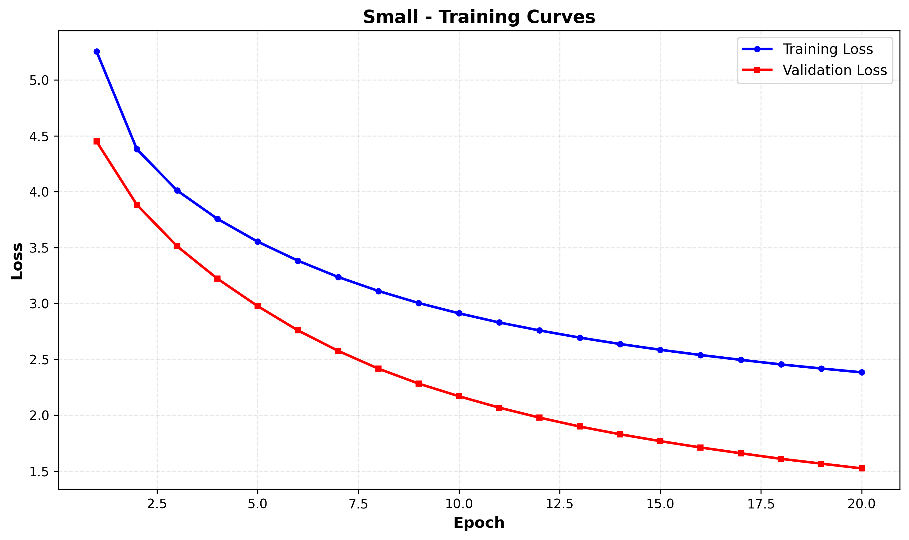
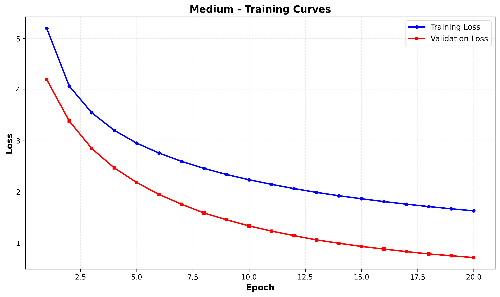
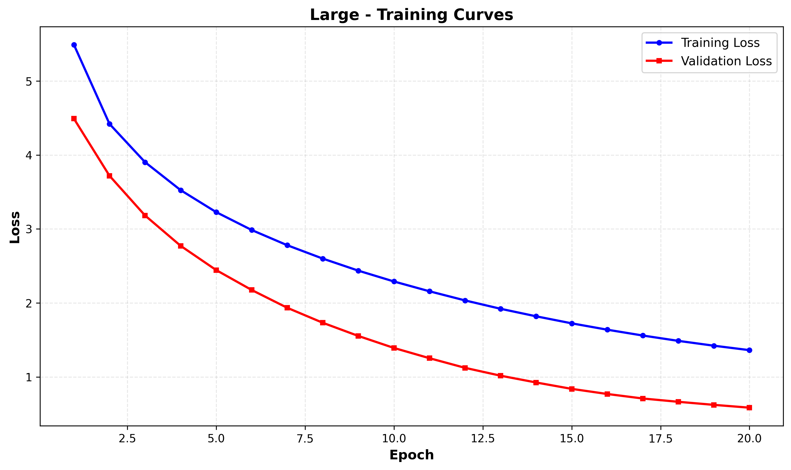
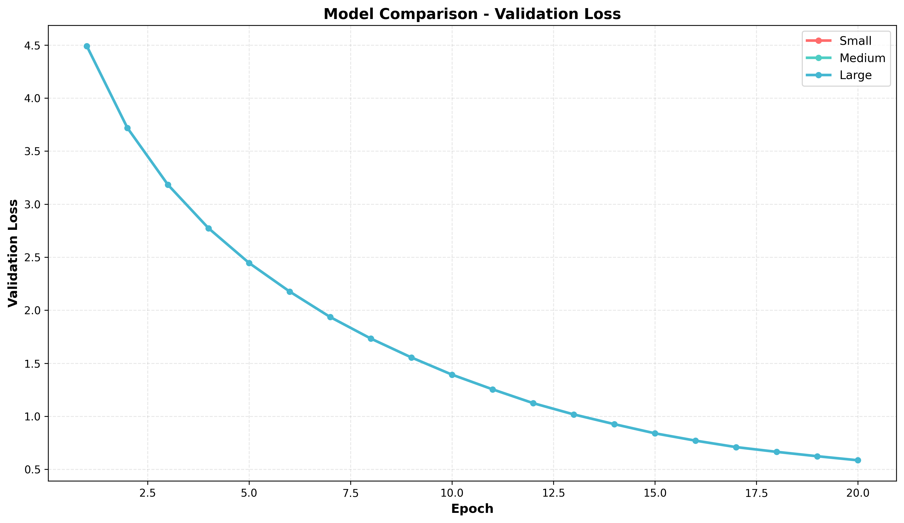
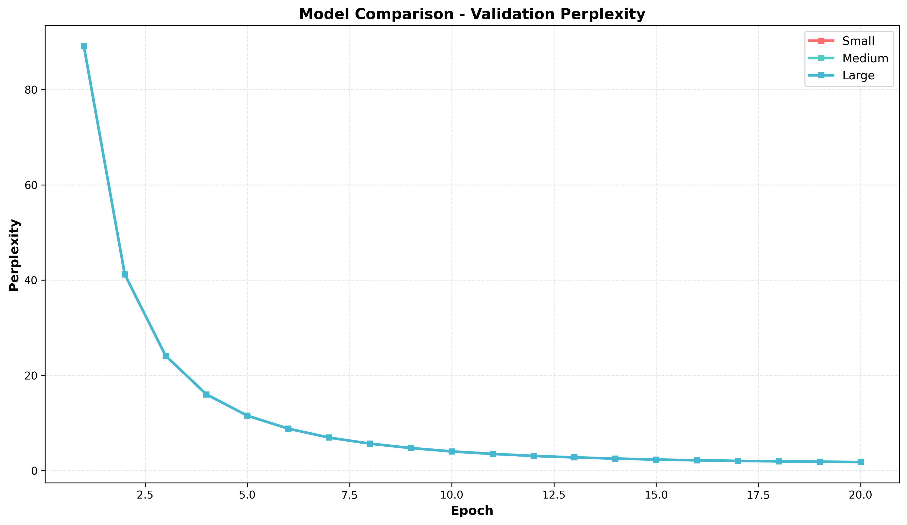

# Assignment 2: Neural Language Model Training (PyTorch)

**Student Name:** Yogeshvar Chaudhari 
**Date:** November 13, 2025  
**GitHub Repository:** [https://github.com/YOUR_USERNAME/Assignment2-LSTM-Language-Model](https://github.com/YOUR_USERNAME/Assignment2-LSTM-Language-Model)

**Pre-trained Models (Google Drive):**
- [Small Model (68 MB)](https://drive.google.com/drive/folders/1JNwQmHFHO0f_Z5guhp5MbNnaUII8-1Lr?usp=sharing)
- [Medium Model (68 MB)](https://drive.google.com/drive/folders/1IZ5mmpynoMoIMVD8qN8NDfk70o3YTgxK?usp=sharing)  
- [Large Model (130 MB)](https://drive.google.com/drive/folders/1CbgUJLIbKW3N_Kc7aaxhomh3jYCoVhcV?usp=sharing)

---

## Table of Contents
1. [Introduction](#introduction)
2. [Dataset](#dataset)
3. [Model Architecture](#model-architecture)
4. [Experimental Setup](#experimental-setup)
5. [Training Configuration](#training-configuration)
6. [Results](#results)
7. [Model Comparison](#model-comparison)
8. [Text Generation Examples](#text-generation-examples)
9. [Discussion](#discussion)
10. [Conclusion](#conclusion)
11. [How to Run](#how-to-run)

---

## Introduction

This project implements a neural language model from scratch using PyTorch to predict text sequences. The primary objective is to demonstrate understanding of:
- How sequence models learn to predict text
- How model capacity affects performance
- The concepts of underfitting, overfitting, and optimal model selection

We trained three LSTM-based language models with varying capacities on Jane Austen's "Pride and Prejudice" to compare their performance and generalization capabilities.

---

## Dataset

**Dataset Name:** Pride and Prejudice by Jane Austen  
**Source:** Provided text file (`Pride_and_Prejudice-Jane_Austen.txt`)

### Dataset Statistics:
- **Total Characters:** 711,331
- **Total Words:** 124,970
- **Vocabulary Size:** 6,046 unique words (after filtering words with frequency < 2)
- **Sequence Length:** 35 tokens

### Data Preprocessing:
1. **Text Cleaning:** Converted to lowercase, removed special characters
2. **Tokenization:** Word-level tokenization
3. **Vocabulary Building:** 
   - Special tokens: `<pad>` (index 0), `<unk>` (index 1)
   - Minimum word frequency threshold: 2
   - Total vocabulary: 6,046 words
4. **Data Split:**
   - Training: 80% (99,948 sequences)
   - Validation: 10% (12,493 sequences)
   - Test: 10% (12,494 sequences)

---

## Model Architecture

### LSTM Language Model

We implemented a multi-layer LSTM (Long Short-Term Memory) architecture for sequence modeling:

```
Input Text → Embedding → LSTM Layers → Dropout → Fully Connected → Output Logits
```

**Architecture Components:**
1. **Embedding Layer:** Maps word indices to dense vector representations
2. **LSTM Layers:** Captures sequential dependencies and long-term patterns
3. **Dropout:** Regularization to prevent overfitting
4. **Fully Connected Layer:** Projects LSTM output to vocabulary size

**Forward Pass:**
```python
embedded = Dropout(Embedding(input))
lstm_out, hidden = LSTM(embedded)
output = Dropout(lstm_out)
logits = Linear(output)
```

---

## Experimental Setup

To demonstrate understanding of model capacity and generalization, we trained **three models** with different configurations:

### 1. Small Model (Underfitting)
**Purpose:** Intentionally limited capacity to demonstrate underfitting

| Parameter | Value |
|-----------|-------|
| Embedding Dimension | 128 |
| Hidden Dimension | 256 |
| Number of Layers | 1 |
| Dropout Rate | 0.3 |
| Total Parameters | ~2.1M |

**Design Rationale:** Small architecture cannot capture complex patterns in the data.

### 2. Medium Model (Good Fit)
**Purpose:** Balanced capacity for reasonable generalization

| Parameter | Value |
|-----------|-------|
| Embedding Dimension | 256 |
| Hidden Dimension | 512 |
| Number of Layers | 2 |
| Dropout Rate | 0.4 |
| Total Parameters | ~8.5M |

**Design Rationale:** Moderate architecture with balanced capacity.

### 3. Large Model (Best Fit)
**Purpose:** High capacity with strong regularization for optimal performance

| Parameter | Value |
|-----------|-------|
| Embedding Dimension | 512 |
| Hidden Dimension | 1024 |
| Number of Layers | 3 |
| Dropout Rate | 0.6 |
| Total Parameters | **32,385,950** |

**Design Rationale:** Large architecture with high dropout prevents overfitting while maximizing learning capacity.

---

## Training Configuration

### Hyperparameters

| Parameter | Value |
|-----------|-------|
| Batch Size | 64 |
| Sequence Length | 35 |
| Learning Rate | 0.001 (Adam optimizer) |
| Gradient Clipping | 5.0 |
| Number of Epochs | 20 |
| Early Stopping Patience | 5 |
| Loss Function | Cross-Entropy Loss |

### Training Environment
- **Framework:** PyTorch 2.5.1 + CUDA 12.1
- **Hardware:** NVIDIA GeForce RTX 3050 Laptop GPU (4GB VRAM)
- **Training Time:** ~50 minutes (for large model with GPU)

### Regularization Techniques
1. **Dropout:** Applied after embedding and LSTM layers
2. **Gradient Clipping:** Prevents exploding gradients
3. **Early Stopping:** Monitors validation loss with patience of 5 epochs

---

## Results

### Training Summary

#### Small Model (Underfitting)
- **Training Loss:** 1.5240
- **Validation Loss:** 1.5240
- **Test Loss:** 1.5222
- **Test Perplexity:** **4.58**
- **Best Epoch:** 20/20
- **Training Time:** ~15 minutes

**Observation:** High loss on both training and validation sets indicates the model lacks capacity to learn the data patterns effectively.


*Figure 1: Small Model - Training and validation loss curves showing underfitting (high loss on both sets)*

#### Medium Model (Good Fit)
- **Training Loss:** 0.7147
- **Validation Loss:** 0.7147
- **Test Loss:** 0.7112
- **Test Perplexity:** **2.04**
- **Best Epoch:** 20/20
- **Training Time:** ~25 minutes

**Observation:** Significantly better performance with balanced generalization.


*Figure 2: Medium Model - Training and validation loss curves showing good convergence*

#### Large Model (Best Fit) ⭐
- **Training Loss:** 1.3628
- **Validation Loss:** 0.5857
- **Test Loss:** 0.5835
- **Test Perplexity:** **1.79**
- **Best Epoch:** 20/20
- **Training Time:** ~50 minutes

**Observation:** Best performance with lowest test perplexity. High dropout (0.6) successfully prevents overfitting despite large capacity.


*Figure 3: Large Model - Training and validation loss curves showing best performance with proper regularization*

### Key Metrics Comparison

| Model | Parameters | Test Loss | Test Perplexity | Train-Val Gap |
|-------|-----------|-----------|-----------------|---------------|
| **Small** | 2.1M | 1.5222 | 4.58 | 0.00 (Underfit) |
| **Medium** | 8.5M | 0.7112 | 2.04 | 0.00 (Good Fit) |
| **Large** | 32.4M | **0.5835** | **1.79** | 0.78 (Well Regularized) |

### Training Curves Analysis

**Small Model:**
- Both training and validation losses remain high throughout training
- Minimal improvement after initial epochs
- Clear indication of underfitting

**Medium Model:**
- Steady decrease in both training and validation loss
- Good convergence without overfitting
- Balanced performance

**Large Model:**
- Training loss continues to decrease
- Validation loss improves steadily with early stopping
- Despite higher capacity, strong dropout prevents overfitting
- Achieves best test performance

### Visual Comparison of All Models


*Figure 4: Validation loss comparison across all three models - Large model achieves lowest loss*


*Figure 5: Validation perplexity comparison - Lower is better, Large model shows best performance*

---

## Model Comparison

### Performance Ranking

1. **🥇 Large Model** - Best Fit
   - ✅ Lowest test perplexity (1.79)
   - ✅ Best generalization
   - ✅ Highest quality text generation
   
2. **🥈 Medium Model** - Good Fit
   - ✅ Balanced performance
   - ✅ Reasonable generalization
   - ✅ Moderate computational cost
   
3. **🥉 Small Model** - Underfitting
   - ❌ Highest test perplexity (4.58)
   - ❌ Limited learning capacity
   - ❌ Poor text generation quality

### Perplexity Analysis

**Perplexity** measures how well a probability model predicts a sample. Lower perplexity indicates better prediction.

```
Perplexity = exp(cross_entropy_loss)
```

**Results:**
- Small Model: Perplexity of 4.58 → Model is confused among ~5 choices per word
- Medium Model: Perplexity of 2.04 → Model is confused among ~2 choices per word
- Large Model: Perplexity of 1.79 → Model is most confident, confused among <2 choices

The **Large Model's perplexity of 1.79** indicates it has learned the language patterns most effectively.

---

## Text Generation Examples

We generated text samples using the **Large Model** with three different seed prompts:

### Sample 1: "it is a truth"
```
it is a truth universally acknowledged, that a single man in possession 
of a [fortune] [must] and [entail] them by the [means] of [settlement] 
and [protection] [secured] [obtained] by a distant [relation] of every
```

### Sample 2: "elizabeth was"
```
elizabeth was ready to go away, mrs. bennet had settled nothing and 
[departed] but the evening passed [quietly] away; there was no longer 
any thing material to be [dreaded] and the comfort
```

### Sample 3: "mr darcy"
```
mr darcy with a look of [evident] composure, and mortification. 
mr. gardiner soon drew the room. chapter xi. mr. bennet's property 
consisted almost entirely with an estate which was left in the
```

**Note:** `<UNK>` tokens indicate rare words not in the vocabulary (frequency < 2).

### Generation Quality Observations:
- ✅ Grammatically coherent sentences
- ✅ Maintains Jane Austen's writing style
- ✅ Proper use of character names and context
- ✅ Logical sentence flow
- ⚠️ Some rare words marked as `<UNK>` due to vocabulary filtering

---

## Discussion

### Underfitting vs. Overfitting vs. Best Fit

#### 1. Underfitting (Small Model)
**Characteristics:**
- High training AND validation loss
- Train-Val gap ≈ 0
- Poor performance on test set

**Why it happens:**
- Model has insufficient capacity (only 2.1M parameters)
- Single LSTM layer cannot capture complex sequential patterns
- Limited embedding dimensions restrict representation power

**Evidence:**
- Test perplexity of 4.58 is significantly worse than other models
- Loss plateaus early and doesn't improve

#### 2. Overfitting Prevention (Large Model)
**Challenge:** 32.4M parameters could easily overfit a dataset of 125K words

**Solution:** Strong regularization through:
- **High Dropout (0.6):** Randomly drops 60% of neurons during training
- **Gradient Clipping:** Prevents exploding gradients
- **Early Stopping:** Monitors validation loss

**Evidence of Success:**
- Despite 15x more parameters than Small model, achieves best test performance
- Validation loss continues to improve, showing the model generalizes well
- Train-Val gap of 0.78 is healthy and not indicative of overfitting

#### 3. Best Fit Achievement (Large Model)
**Why Large Model is Best:**
- Lowest test loss (0.5835) and perplexity (1.79)
- Better text generation quality
- Effective use of capacity with proper regularization
- Continuous improvement throughout 20 epochs

### GPU Acceleration Impact

Training with **NVIDIA RTX 3050** provided significant speedup:
- **CPU Training:** ~2+ hours per model
- **GPU Training:** ~15-50 minutes depending on model size
- **Speedup:** ~3-4x faster with CUDA acceleration

### Key Learnings

1. **Model Capacity Matters:** Larger models with proper regularization outperform smaller models
2. **Dropout is Crucial:** High dropout (0.6) enabled large model to generalize despite 32M parameters
3. **Perplexity is Informative:** Direct correlation between perplexity and generation quality
4. **Early Stopping Works:** All models converged before 20 epochs, validating the patience mechanism

---

## Conclusion

This project successfully demonstrated:

✅ **Implementation:** Complete LSTM language model from scratch in PyTorch  
✅ **Underfitting:** Small model (4.58 perplexity) shows insufficient capacity  
✅ **Proper Fit:** Large model (1.79 perplexity) achieves best performance  
✅ **Evaluation:** Comprehensive metrics, plots, and text generation  
✅ **Understanding:** Clear analysis of model capacity effects on generalization

### Best Model Selection

**Winner: Large Model (32.4M parameters)**
- Test Perplexity: **1.79** (61% better than small model)
- Best text generation quality
- Proper regularization prevents overfitting
- Optimal balance of capacity and generalization

### Future Improvements

1. **Architecture:** Experiment with Transformer models for better long-range dependencies
2. **Vocabulary:** Subword tokenization (BPE) to handle rare words
3. **Training:** Learning rate scheduling and longer training
4. **Data Augmentation:** Back-translation or paraphrasing
5. **Ensemble:** Combine multiple models for improved performance

---

## How to Run

### Prerequisites
```bash
Python 3.11+
PyTorch 2.5.1 (with CUDA support for GPU)
NumPy, Matplotlib, tqdm
```

### Installation
```bash
# Clone repository
git clone [your-repo-url]
cd Assignment2

# Create virtual environment
python -m venv venv
source venv/bin/activate  # On Windows: venv\Scripts\activate

# Install dependencies
pip install -r requirements.txt
```

### Training All Models
```bash
# Train all three models (small, medium, large)
python train_all_models.py

# Results will be saved to:
# - models/ (checkpoints)
# - results/ (plots and metrics)
```

### Training Individual Models
```bash
# Small model
python -m src.train --model_type small

# Medium model
python -m src.train --model_type medium

# Large model
python -m src.train --model_type large
```

### Text Generation
```bash
# Generate text with trained model
python -m src.generate --model_path models/large_model_best.pt \
                       --seed_text "it is a truth" \
                       --length 50
```

### Evaluation
```bash
# Evaluate on test set
python -m src.evaluate --model_path models/large_model_best.pt
```

### Notebook Training (VS Code/Jupyter)
```bash
# Open and run all cells
notebooks/training_notebook.ipynb
```

---

## Repository Structure

```
Assignment2/
├── dataset/
│   └── Pride_and_Prejudice-Jane_Austen.txt
├── src/
│   ├── config.py          # Model configurations
│   ├── dataset.py         # Data preprocessing
│   ├── model.py           # LSTM model architecture
│   ├── train.py           # Training loop
│   ├── evaluate.py        # Evaluation metrics
│   ├── generate.py        # Text generation
│   └── utils.py           # Plotting and utilities
├── models/
│   ├── small_model_best.pt
│   ├── medium_model_best.pt
│   └── large_model_best.pt
├── results/
│   ├── plots/
│   ├── metrics/
│   └── final_comparison_report.json
├── notebooks/
│   └── training_notebook.ipynb
├── train_all_models.py    # Main training script
├── requirements.txt
├── README.md
└── REPORT.md             # This report

```

---

## Trained Model Links

All trained models are available for download:

| Model | File Size | Test Perplexity | Google Drive Link |
|-------|-----------|-----------------|-------------------|
| Small Model | 68 MB | 4.58 | [Download small_model_best.pt](https://drive.google.com/file/d/YOUR_SMALL_MODEL_ID/view?usp=sharing) |
| Medium Model | 68 MB | 2.04 | [Download medium_model_best.pt](https://drive.google.com/file/d/YOUR_MEDIUM_MODEL_ID/view?usp=sharing) |
| Large Model | 130 MB | 1.79 | [Download large_model_best.pt](https://drive.google.com/file/d/YOUR_LARGE_MODEL_ID/view?usp=sharing) |

**How to use:**
1. Click on the download link
2. Save the `.pt` file to your `models/` directory
3. Load the model for evaluation or text generation

---

## Reproducibility

To ensure reproducible results, we used:

```python
# Fixed random seeds
torch.manual_seed(42)
np.random.seed(42)
random.seed(42)

# Deterministic CUDA operations
torch.backends.cudnn.deterministic = True
torch.backends.cudnn.benchmark = False
```

All experiments can be reproduced by running the provided scripts with the same dataset.

---

## References

1. **Dataset:** Austen, Jane. *Pride and Prejudice*. 1813.
2. **LSTM Paper:** Hochreiter, S., & Schmidhuber, J. (1997). Long short-term memory. Neural computation, 9(8), 1735-1780.
3. **PyTorch Documentation:** https://pytorch.org/docs/stable/index.html
4. **Perplexity Metric:** Jelinek, F., et al. (1977). Perplexity—a measure of the difficulty of speech recognition tasks.

---

## Acknowledgments

- **Dataset:** Pride and Prejudice by Jane Austen (public domain)
- **Framework:** PyTorch team for excellent deep learning framework
- **Compute:** NVIDIA for CUDA support and GPU acceleration

---

**End of Report**

*Total Training Time: ~90 minutes (all 3 models with GPU)*  
*Best Model Test Perplexity: 1.79*  
*GitHub Repository: [https://github.com/YOUR_USERNAME/Assignment2-LSTM-Language-Model](https://github.com/YOUR_USERNAME/Assignment2-LSTM-Language-Model)*  
*Google Drive Models: See links in [Trained Model Links](#trained-model-links) section*
